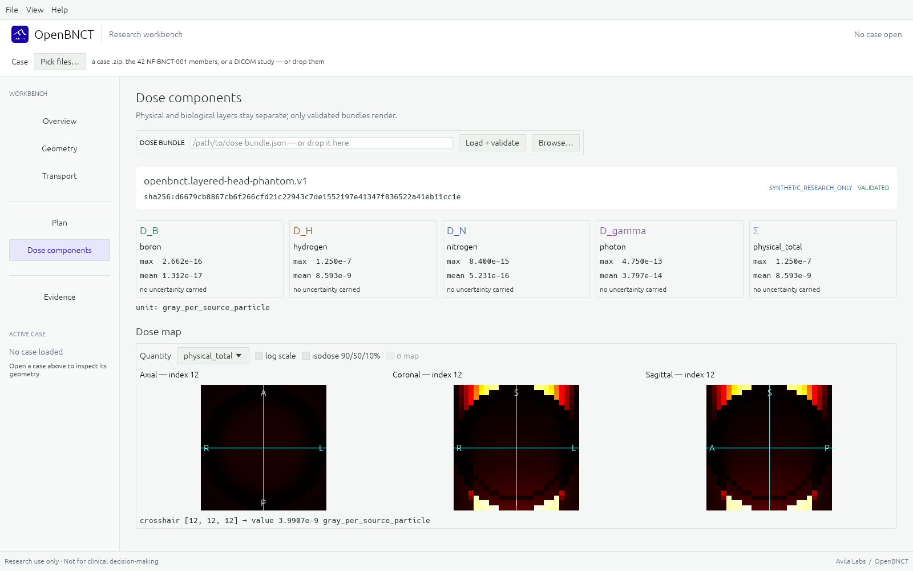

# OpenBNCT

[](https://github.com/AvilaLabs/OpenBNCT/actions/workflows/ci.yml)
[](LICENSE)
[](https://crates.io/crates/openbnct-core)
[](https://pypi.org/project/openbnct/)
[](DISCLAIMER.md)

**English** | [日本語](README.ja.md)

OpenBNCT is a research workbench for boron neutron capture therapy (BNCT)
dosimetry and verification. Every artifact — case, dose bundle, plan,
comparison — is versioned and SHA-256-bound to its inputs, so a result is
reproducible by construction rather than by convention.

<p align="left">
  <a href="https://openbnct.avilalabs.org"></a>
  <a href="https://github.com/AvilaLabs/OpenBNCT/releases/latest"></a>
</p>



> **Research software** — not a medical device, not commissioned for any
> treatment facility, not for clinical decisions. See
> [DISCLAIMER.md](DISCLAIMER.md).

## What it does

- **Component dosimetry** — boron, nitrogen, hydrogen, and photon dose as
  separate fields with per-voxel uncertainty; DVH and region metrics;
  NIfTI, DICOM, and PET/SUV round-trips; biological interpretation held
  strictly apart from physical dose.
- **Transport-neutral execution** — OpenMC as the first backend, a
  deterministic multigroup S_N solver (discrete-ordinates, P0–P5
  anisotropy, adjoint solves), MCNP and PHITS deck emitters, and
  meshtal/tally importers — one interchange contract throughout.
- **Verification tooling** — gamma analysis, metamorphic oracles,
  measurement-record comparison, published-beam validation (FiR 1 K63),
  and a closed-form absorber oracle. Failed checks stay in the record.
- **Uncertainty propagation** — ENDF MF33 covariances collapsed to
  multigroup form and folded into an auditable dose-uncertainty budget.
- **Plan research** — beam-direction enumeration with adjoint scoring,
  multi-field sweeps, non-negative weight optimization against
  dose-volume and isoeffective objectives.
- **Prompt-gamma sources** — the 478 keV ¹⁰B(n,α) production field
  emitted as a versioned artifact for imaging and detector research.

## The web build

The same Rust compiles to WebAssembly at
[openbnct.avilalabs.org](https://openbnct.avilalabs.org). Drop a dose
bundle, plan, NIfTI volume, or uncertainty budget onto the page; it is
validated and routed to the right workspace. Nothing leaves the browser —
there is no upload. The UI runs in English, 日本語, Italiano, 中文, and
Español; requires WebGL2 or WebGPU (Chrome, Edge, Firefox work;
LibreWolf needs WebGL enabled per-site). Case folders and process
execution remain desktop-only.

## Install

```text
cargo install openbnct-cli               # CLI from crates.io
pip install openbnct                     # Python bindings from PyPI
```

Desktop builds are on the
[releases page](https://github.com/AvilaLabs/OpenBNCT/releases/latest);
from source: `cargo build --workspace`, `cargo run --bin openbnct-gui`.

## Status

Early research. The 600M-history OpenMC candidate for the frozen
`NF-BNCT-001` benchmark passes every statistical acceptance gate; it is
not promoted to a reference output until an independently implemented
transport path reproduces it. MCNP/PHITS interop is verified at benchmark
scale on documented-format bundles; real-engine acceptance remains open.
The FiR 1 in-phantom comparisons keep their misses in the record —
that gap is evidence, not a defect to hide. [ROADMAP.md](ROADMAP.md)
carries the milestone detail.

## Documentation

- [`docs/USAGE.md`](docs/USAGE.md) — command and workflow reference
- [`benchmarks/synthetic/nf-bnct-001/SPECIFICATION.md`](benchmarks/synthetic/nf-bnct-001/SPECIFICATION.md)
  — the frozen case and its predeclared gates
- [`conformance/`](conformance/) — public fixture suites
- [`docs/adr/`](docs/adr/) — architecture decision records
- [`docs/research/`](docs/research/) — technical baseline, cross-code recipe

## License

Apache-2.0. The repository must not implement Avify Dose patent subject
matter without an IP review — see [docs/IP_BOUNDARY.md](docs/IP_BOUNDARY.md).
