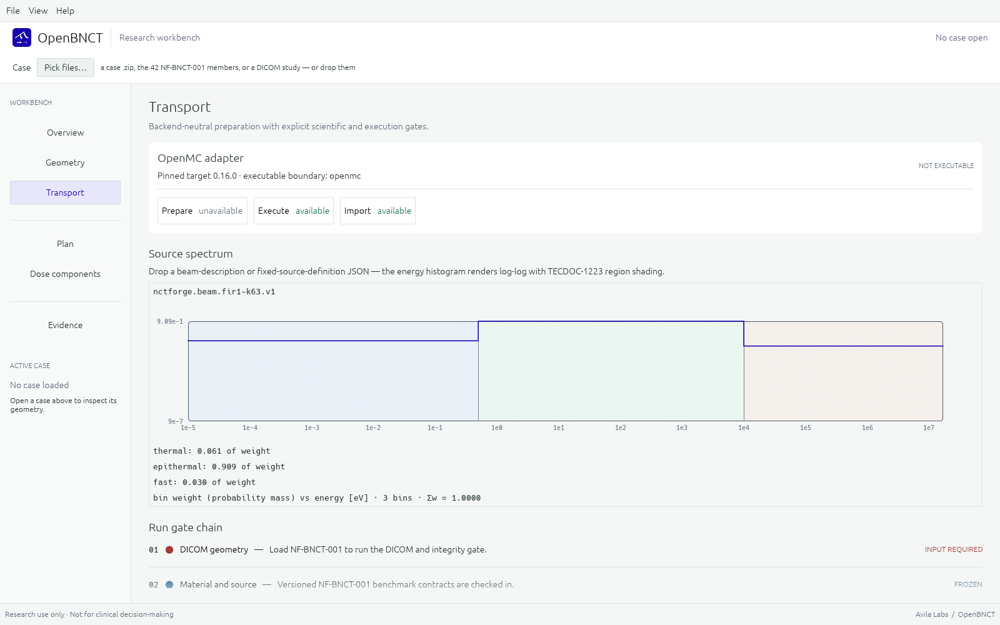
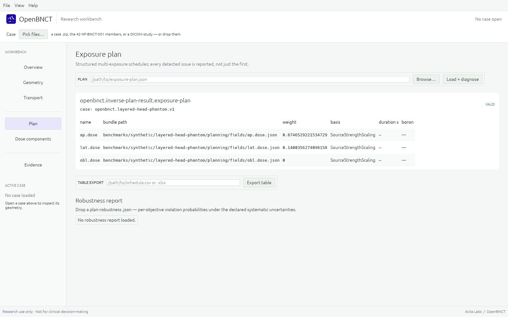

# OpenBNCT

[](https://github.com/AvilaLabs/OpenBNCT/actions/workflows/ci.yml)
[](LICENSE)
[](https://crates.io/crates/openbnct-core)
[](https://pypi.org/project/openbnct/)
[](docs/DISCLAIMER.md)

**English** | [日本語](README.ja.md)

OpenBNCT is a research workbench for boron neutron capture therapy (BNCT)
dosimetry and verification. Every artifact — case, dose bundle, plan,
comparison — is versioned and SHA-256-bound to its inputs, so a result is
reproducible by construction rather than by convention.

<p align="left">
  <a href="https://openbnct.avilalabs.org"></a>
  <a href="https://github.com/AvilaLabs/OpenBNCT/releases/latest"></a>
</p>


| | |
|---|---|
|  |  |

> **Research software** — not a medical device, not commissioned for any
> treatment facility, not for clinical decisions. See
> [DISCLAIMER.md](docs/DISCLAIMER.md).

## What it does

- **Component dosimetry** — boron, nitrogen, hydrogen, and photon dose as
  separate fields with per-voxel uncertainty; DVH and region metrics;
  NIfTI, DICOM, and PET/SUV round-trips; biological interpretation held
  strictly apart from physical dose.
- **Transport-neutral execution** — OpenMC as the first backend, a
  deterministic multigroup S_N solver (discrete-ordinates, P0–P5
  anisotropy, adjoint solves), MCNP and PHITS deck emitters, and
  meshtal/tally importers — one interchange contract throughout. The
  deterministic path needs no external codes: OpenMC, MCNP, and PHITS are
  optional interop, not prerequisites.
- **Verification tooling** — gamma analysis, metamorphic oracles,
  measurement-record comparison, published-beam validation (FiR 1 K63),
  and a closed-form absorber oracle. Failed checks stay in the record.
- **Uncertainty propagation** — ENDF MF33 covariances collapsed to
  multigroup form and folded into an auditable dose-uncertainty budget.
- **Plan research** — beam-direction sweeps scored by tissue path and
  adjoint importance, emitted as content-bound candidates; aimed-field
  solves; non-negative weight optimization against dose-volume and
  isoeffective objectives.
- **Prompt-gamma delivery verification** — the 478 keV ¹⁰B(n,α)
  chain end to end: voxel emission maps, a detector position's full
  response column in a single adjoint solve, expected-counts folds,
  and regularized reconstruction (FISTA NNLS with a Tikhonov term)
  back to a boron-emission field — an open forward/inverse path for
  in-beam monitoring research.
- **Cell-level stochastic microdosimetry** — seeded sampling of a
  declared boron microdistribution: gamma uptake heterogeneity,
  Poisson captures, compartment-placed isotropic α/⁷Li tracks into a
  spherical nucleus. Produces the specific-energy distribution P(z),
  the untouched-cell fraction, and an MKM-consumable nucleus lineal
  spectrum; an SMK model then integrates survival over the sampled
  population, compares against the MK mean-field, and folds into
  voxel dose bundles with `smk_stochastic` semantics.
- **Biological model families** — component-weight, González & Santa
  Cruz isoeffective, microdosimetric-kinetic, and stochastic-MK
  models over one contract, plus BED/EQD2 combination and
  TCP/NTCP/UTCP endpoints — each emitting versioned artifacts that
  assert research-only scope.

## The web build

The same Rust compiles to WebAssembly at
[openbnct.avilalabs.org](https://openbnct.avilalabs.org). Drop a dose
bundle, plan, NIfTI volume, or uncertainty budget onto the page; it is
validated and routed to the right workspace. Nothing leaves the browser —
there is no upload. The UI runs in English, 日本語, Italiano, 中文, and
Español; requires WebGL2 or WebGPU (Chrome, Edge, Firefox work;
LibreWolf needs WebGL enabled per-site). Case folders and process
execution remain desktop-only.

## Install

```text
cargo install openbnct-cli               # CLI from crates.io
pip install openbnct                     # Python bindings from PyPI
```

Desktop builds are on the
[releases page](https://github.com/AvilaLabs/OpenBNCT/releases/latest);
from source: `cargo build --workspace`, `cargo run --bin openbnct-gui`.

## Try it

Solve the shipped layered-head benchmark with the deterministic solver —
no external codes needed — then open the result in the workbench:

```text
git clone https://github.com/AvilaLabs/OpenBNCT && cd OpenBNCT
openbnct sn solve --case benchmarks/synthetic/layered-head-phantom/case.json \
    --data benchmarks/synthetic/layered-head-phantom/multigroup-data-28g-v2.json \
    --assignment benchmarks/synthetic/layered-head-phantom/assignment.json \
    --dose dose.json --output flux.json
```

Or skip the terminal entirely: open
[openbnct.avilalabs.org](https://openbnct.avilalabs.org) and press
**Load example bundle** in the dose workspace — the bundled benchmark
artifact is built into the app.

To bring your own phantom: a segmented NIfTI labelmap plus a
label→material table becomes a transport case in one command
(`import labelmap`); a digitized facility spectrum becomes a
beam-description with `beam build`. See
[`docs/BYOC.md`](docs/BYOC.md).

## Status

Early research. The 600M-history OpenMC candidate for the frozen
`NF-BNCT-001` benchmark passes every statistical acceptance gate; it is
not promoted to a reference output until an independently implemented
transport path reproduces it. MCNP/PHITS interop is verified at benchmark
scale on documented-format bundles; real-engine acceptance remains open.
The FiR 1 in-phantom comparisons keep their misses in the record —
that gap is evidence, not a defect to hide. [docs/ROADMAP.md](docs/ROADMAP.md)
carries the milestone detail.

## Documentation

- [`docs/USAGE.md`](docs/USAGE.md) — command and workflow reference
- [`benchmarks/synthetic/nf-bnct-001/SPECIFICATION.md`](benchmarks/synthetic/nf-bnct-001/SPECIFICATION.md)
  — the frozen case and its predeclared gates
- [`conformance/`](conformance/) — public fixture suites
- [`docs/adr/`](docs/adr/) — architecture decision records
- [`docs/research/`](docs/research/) — technical baseline, cross-code recipe

## Citing

`CITATION.cff` at the repo root gives the citation; GitHub's "Cite this
repository" sidebar renders it.

## Questions

[Issues](https://github.com/AvilaLabs/OpenBNCT/issues) and
[discussions](https://github.com/AvilaLabs/OpenBNCT/discussions) are open.

## License

MIT. The repository must not implement Avify Dose patent subject
matter without an IP review — see [docs/IP_BOUNDARY.md](docs/IP_BOUNDARY.md).
