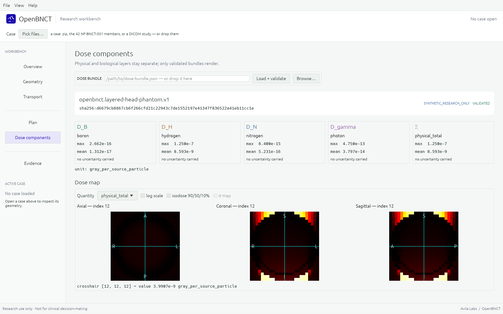
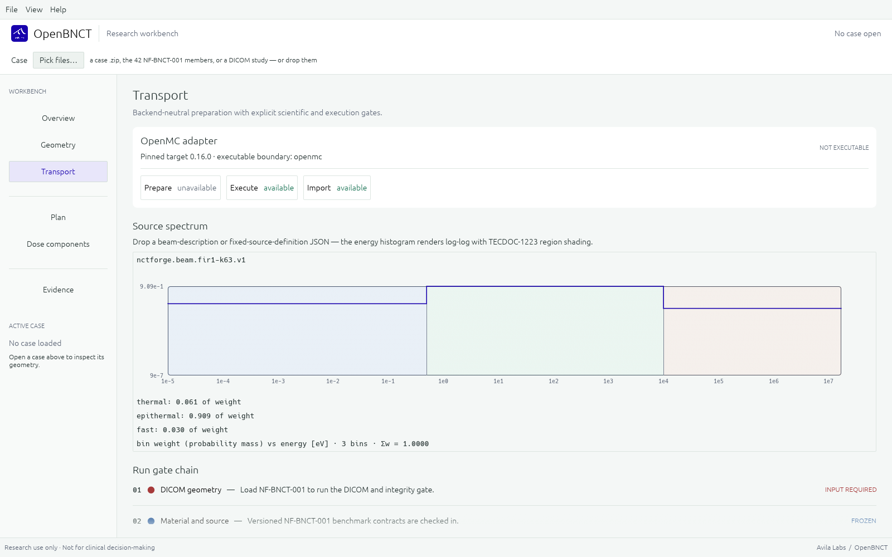
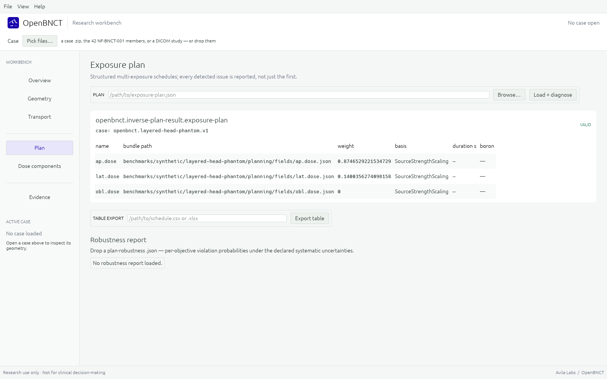
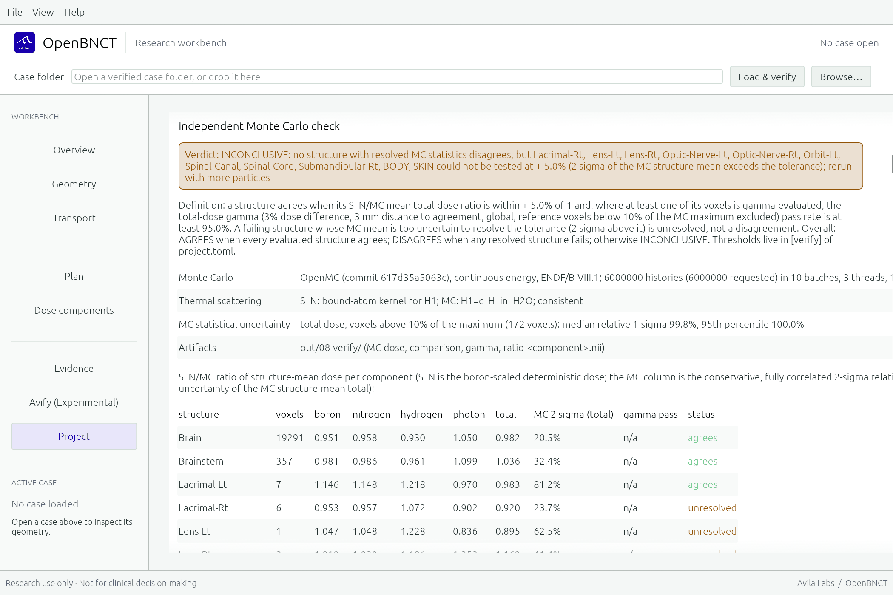

# OpenBNCT

[](https://github.com/AvilaLabs/OpenBNCT/actions/workflows/ci.yml)
[](LICENSE)
[](https://crates.io/crates/openbnct-core)
[](https://pypi.org/project/openbnct/)
[](docs/DISCLAIMER.md)

**English** | [日本語](README.ja.md)

OpenBNCT is an open-source research workbench for boron neutron capture
therapy (BNCT). Calculate component dose, estimate spatial and time-varying
boron uptake, compare biological models, optimize multi-field research
plans, and investigate dose uncertainty and prompt-gamma measurements.

It combines a deterministic neutron/photon transport solver with OpenMC
integration and MCNP/PHITS interchange. The Rust implementation powers the
CLI, Python bindings, desktop app, and browser workbench.

[Handbook](https://openbnct.avilalabs.org/docs/) · [First study](https://openbnct.avilalabs.org/docs/quick-start.html) · [Benchmarks explained](https://openbnct.avilalabs.org/docs/benchmarks.html)

<p align="left">
  <a href="https://openbnct.avilalabs.org"></a>
  <a href="https://github.com/AvilaLabs/OpenBNCT/releases/latest"></a>
</p>



| | |
|---|---|
|  |  |

> **Research software** — not a medical device, not commissioned for any
> treatment facility, not for clinical decisions. See
> [DISCLAIMER.md](docs/DISCLAIMER.md).

## What researchers can compute

The capabilities below describe the current source tree; packaged releases
can lag development. The [usage reference](docs/USAGE.md) documents command
options and supported input formats.

| Research task | Implemented capabilities |
|---|---|
| **Component dose and dose-volume analysis** | Separate boron, nitrogen, hydrogen, and photon fields; physical totals and available statistical uncertainties; DVHs, D95, Vx, EUD, and region summaries. |
| **Neutron and photon transport** | In-house multigroup discrete-ordinates (S_N) transport, P0–P5 neutron scattering, coupled photon transport, forward/adjoint solves, and OpenMC execution. CADIS/FW-CADIS weight windows support Monte Carlo variance reduction. The deterministic solver works without an external transport code. |
| **Imaging and heterogeneous anatomy** | DICOM CT, RT Structure Set, MR, and PET import; NIfTI volumes and labelmaps; rigid registration and resampling; HU-to-material calibration; RT Dose export and static-beam RT Plan import/export. |
| **PET-derived boron fields** | Voxelwise B-10 estimates from registered SUV images using ratio, calibrated-linear, or uniform uptake models; input-uncertainty propagation, washout correction, and material assignment for transport, or post-hoc application of blood concentration × tissue:blood ratios (or a PET field) to a unit-concentration boron dose under a trace-B-10 approximation. These are model-derived estimates. |
| **Boron kinetics and irradiation timing** | Fit mono-/biexponential concentration curves to samples, model changing tissue:blood ratios, compare irradiation windows under declared organ-dose limits, and emit time-integrated component-dose maps. |
| **Multi-field and robust plan research** | Beam-direction ranking by tissue path or adjoint importance; objective-driven field selection and iterative weight optimization; spectrum/aperture candidate sweeps and beamlet shaping. Evaluate named uptake, output, and positioning scenarios and optimize weights against their worst-case penalty. |
| **Uncertainty and sensitivity** | Systematic boron, positioning, and component uncertainties; first-order plan-metric uncertainty; supported ENDF MF33 nuclear-data covariances propagated to integrated dose-response budgets; Morris/Sobol screening of declared transport inputs. |
| **Biological dose and response models** | CBE/RBE component weighting; González–Santa Cruz photon-isoeffective, microdosimetric-kinetic (MKM), and stochastic-MK models; parameter sweeps and model comparisons; fractionation, BED/EQD2, combined-treatment analysis, and declared TCP/NTCP/UTCP models. |
| **Cell-level boron microdosimetry** | Compartmental boron localization, cell-to-cell uptake heterogeneity, stochastic captures and alpha/lithium tracks; nucleus specific-energy distributions, untouched-cell fractions, lineal-energy spectra, and population-survival comparisons. |
| **Prompt-gamma reconstruction research** | 478 keV emission maps, adjoint detector responses with aperture acceptance, expected counts under a declared calibration, and regularized non-negative reconstruction of emission fields. |
| **Beam and beam-shaping studies** | Published or user-defined beam spectra, beam-quality metrics, a lithium-target accelerator-source model, beam-shaping assembly definitions, and thickness-sweep generation. |
| **Independent comparison and interchange** | Component-wise dose comparison, gamma analysis, analytic and metamorphic checks, and measurement comparisons; MCNP/PHITS deck export and output import; component NIfTI exchange and CSV/XLSX exposure plans. |

The research layers have explicit limits. Scenario positioning currently
shifts existing dose fields; it does not re-solve transport through moved
anatomy. Optimization's `isoeffective` objectives use fixed component
weights, while full nonlinear biological evaluation is a separate path.
Current-source joint ensembles propagate explicitly declared shared/correlated
sources and supported PK draws; they do not infer a complete patient uncertainty
model. Retrospective delivery and measurement-informed boron workflows also
require explicit clocks, calibration, observations and reduced-model assumptions.
Prompt-gamma reconstruction remains an imaging research model. See the
[uncertainty guide](https://openbnct.avilalabs.org/docs/uncertainty.html) and
[usage reference](docs/USAGE.md) for current scope and remaining limits.

Cases, models, plans, and result artifacts are versioned and SHA-256-bound
to their inputs. CLI, GUI, and Python surfaces reuse the Rust crates;
individual features may reach these surfaces at different times.

## Benchmarks and recorded evidence

The repository includes analytic checks, published transport problems,
Monte Carlo comparisons, measured-phantom comparisons, and model-specific
research fixtures. These are committed results for their declared inputs
and solver versions, not a claim that every current configuration passes.

| Case or suite | What the recorded evidence establishes | Scope and remaining work |
|---|---|---|
| [NF-BNCT-001](benchmarks/synthetic/nf-bnct-001/SPECIFICATION.md) | A 600M-history OpenMC candidate passes the frozen case's [statistical acceptance gates](benchmarks/synthetic/nf-bnct-001/transport/openmc-acceptance-report-600M.json). | Candidate reference; independent transport reproduction is still required for reference promotion. |
| [NF-BNCT-003 absorber](benchmarks/synthetic/nf-bnct-003/SPECIFICATION.md) | The [recorded deterministic result](benchmarks/synthetic/nf-bnct-003/transport/analytic-oracle-evaluation-wdd.json) recovers the analytic boron-dose attenuation slope of −0.2308 cm⁻¹ within its declared tolerance. | One-group, near-pure B-10 absorber; a check against a closed-form solution. |
| [Reed](validation/canonical-reed-problem/README.md), [Azmy](validation/canonical-azmy-problem/README.md), and [Kobayashi](validation/canonical-kobayashi-p1/README.md) | Canonical tests of source deposition, heterogeneity, spatial/angular discretization, and void streaming. Reed and Azmy pass their case-specific checks; Kobayashi passes the graded near-field probes. | Kobayashi also records severe deep-field ray effects; its near-field pass does not qualify the full field. |
| [Kobayashi MC comparison](validation/intercomparison-kobayashi-p1/README.md) and [layered-head MC comparison](validation/intercomparison-layered-head/README.md) | Shared-case OpenMC comparisons separate transport-method differences from input differences. | The layered-head multigroup/continuous-energy discrepancy investigation remains open, including R17-04 group-boundary work. |
| FiR 1 K63 [water](validation/fir1-k63-cylindrical-phantom/README.md), [PMMA](validation/fir1-k63-pmma-phantom/README.md), and [borated liquid](validation/fir1-k63-liquid-b-phantom/README.md) | Comparisons with published/digitized phantom profiles under specified beam and material assumptions. | Normalized-profile agreement in selected fixtures does not establish absolute-dose agreement; multigroup results retain documented discrepancies. |
| [Scenario optimizer oracle](benchmarks/synthetic/scenario-robust-planning/SPECIFICATION.md) and [FiR 1 scenario study](validation/fir1-k63-scenario-budget/SPECIFICATION.md) | A known-answer robust-weight problem and a study of declared uptake/output/position perturbations. | The scenario set is not a calibrated probability distribution or a clinical robustness certificate. |
| [PK timing study](validation/fir1-k63-pmma-pk-anchors/SPECIFICATION.md) and [cell microdosimetry study](validation/cell-microdosimetry-sato2018/SPECIFICATION.md) | Dose accumulation and cellular-model behavior under declared inputs drawn from published research. | Model checks using declared curves/distributions; not patient validation or independent measurements. |
| [Prompt-gamma geometry study](validation/pg-benedicte-geometry/SPECIFICATION.md) | A transported forward/inverse experiment showing the effect of collimation on localization. | Uncollimated inversion fails to localize; the collimated example still merges the two vial sources. |

[Conformance suites](conformance/README.md) separately check interchange,
adapter parsing, biological models, and endpoint calculations. Parser
fixtures do not establish real-engine MCNP/PHITS agreement.
[NF-BNCT-002](benchmarks/synthetic/nf-bnct-002/SPECIFICATION.md) supplies a
frozen heterogeneous deep-penetration case; its transport execution remains
pending. See [validation](validation/README.md) and the
[roadmap](docs/ROADMAP.md) for the evidence and remaining milestones.

## The web build

The same Rust compiles to WebAssembly at
[openbnct.avilalabs.org](https://openbnct.avilalabs.org). Drop a dose
bundle, plan, NIfTI volume, or uncertainty budget onto the page; it is
validated and routed to the right workspace. Nothing leaves the browser —
there is no upload. The UI runs in English, 日本語, Italiano, 中文, and
Español; requires WebGL2 or WebGPU (Chrome, Edge, Firefox work;
LibreWolf needs WebGL enabled per-site). Case folders and process
execution remain desktop-only.

## Install

```text
cargo install openbnct-cli               # CLI from crates.io
pip install openbnct                     # Python bindings from PyPI
```

Desktop builds are on the
[releases page](https://github.com/AvilaLabs/OpenBNCT/releases/latest);
from source: `cargo build --workspace`, `cargo run --bin openbnct-gui`.

## Try it

From a CT plus RT Structure Set to component dose, boron-scaled dose, DVHs and
a report in two commands, no external codes needed. This runs the synthetic
NF-BNCT-001 study (a research demonstration, not a patient case):

```text
openbnct benchmark generate study/
openbnct project init --dicom study --output p001 --target CORE --spacing-mm 8
openbnct project run p001
```

The solve takes several minutes on a laptop with a release build. The report
lands at
`p001/out/report.md` (and `report.json`), with per-structure DVH curves in
`p001/out/dvh/*.csv`. Every step is a hash-bound artifact under `p001/out/`;
the report lists the exact command line of each, and rerunning skips steps
whose inputs are unchanged. See [`docs/USAGE.md`](docs/USAGE.md#quick-start-project).
The desktop app's Project tab runs the same workflow (DICOM folder or NIfTI CT
volume in, report and Monte Carlo check out):



With OpenMC 0.16.0 and the ENDF/B-VIII.1 library installed,
`openbnct project verify p001` adds an independent continuous-energy Monte Carlo
check of the same study and reports the agreement in the same report.

> **Accuracy status (2026-09-30):** on the synthetic layered-head benchmark the
> default project workflow (beam histogram bins spread uniformly per eV as in
> OpenMC/MCNP, capture photons transported with `sn photon-solve`) gives
> structure-mean boron, fast-neutron ("hydrogen") and photon dose within about
> 15% of continuous-energy OpenMC run with the same S(α,β): whole phantom
> 0.86 / 0.98 / 0.93, target 1.06 / 0.90 / 1.03 (S8, 5e6 histories; the
> phantom has no nitrogen dose). With `photon_transport = false` the multigroup
> data deposits capture-γ energy locally and the photon component is ~3–4×
> high. One synthetic geometry is not a validation of your study;
> `openbnct project verify` runs this Monte Carlo check on any project. See
> [the validation note](validation/intercomparison-layered-head/2026-09-29-accuracy-fixes.md).

Under the hood, the deterministic solver on its own — the shipped
layered-head benchmark — then open the result in the workbench:

```text
git clone https://github.com/AvilaLabs/OpenBNCT && cd OpenBNCT
openbnct sn solve --case benchmarks/synthetic/layered-head-phantom/case.json \
    --data benchmarks/synthetic/layered-head-phantom/multigroup-data-28g-v5-tsl.json \
    --assignment benchmarks/synthetic/layered-head-phantom/assignment.json \
    --source-weighting uniform_in_bin --dose dose.json --output flux.json
```

With the defaults (S4, P1, CMFD acceleration) this converges in 14 outer
iterations — under a minute on 2 cores with a release build.

Or skip the terminal entirely: open
[openbnct.avilalabs.org](https://openbnct.avilalabs.org) and press
**Load example bundle** in the dose workspace — the bundled benchmark
artifact is built into the app.

To bring your own phantom: a segmented NIfTI labelmap plus a
label→material table becomes a transport case in one command
(`import labelmap`); a digitized facility spectrum becomes a
beam-description with `beam build`. See
[`docs/BYOC.md`](docs/BYOC.md).

## Status

Active research development. External reproduction, BNCT-physicist review,
broader measured-data comparisons, and cross-institution execution remain
milestones. Current capabilities and acceptance evidence are tracked in
[docs/ROADMAP.md](docs/ROADMAP.md); the
[research work handoff](docs/RESEARCH_WORK_HANDOFF.md) details proposed
extensions for joint uncertainty, delivery replay, and measurement-informed
boron estimation.

## Documentation

Start with the **[OpenBNCT Handbook](https://openbnct.avilalabs.org/docs/)** for installation, first studies, transport, boron/biology, planning, uncertainty, Python and [benchmark interpretation](https://openbnct.avilalabs.org/docs/benchmarks.html). Its source is [`docs/guide/`](docs/guide/). It describes current-source capabilities and distinguishes them from older packaged releases and frozen evidence.

Detailed research records and reference material:

- [`docs/USAGE.md`](docs/USAGE.md) — command and workflow reference
- [`benchmarks/synthetic/nf-bnct-001/SPECIFICATION.md`](benchmarks/synthetic/nf-bnct-001/SPECIFICATION.md)
  — the frozen case and its predeclared gates
- [`conformance/`](conformance/) — public fixture suites
- [`validation/`](validation/) — transport and measured-phantom comparisons
- [`docs/RESEARCH_WORK_HANDOFF.md`](docs/RESEARCH_WORK_HANDOFF.md) — scoped
  implementation packages and acceptance criteria for the next research work
- [`docs/adr/`](docs/adr/) — architecture decision records
- [`docs/research/`](docs/research/) — technical baseline, cross-code recipe

## Citing

`CITATION.cff` at the repo root gives the citation; GitHub's "Cite this
repository" sidebar renders it.

## Questions

[Issues](https://github.com/AvilaLabs/OpenBNCT/issues) and
[discussions](https://github.com/AvilaLabs/OpenBNCT/discussions) are open.

## License

MIT. The repository must not implement Avify Dose patent subject
matter without an IP review — see [docs/IP_BOUNDARY.md](docs/IP_BOUNDARY.md).
